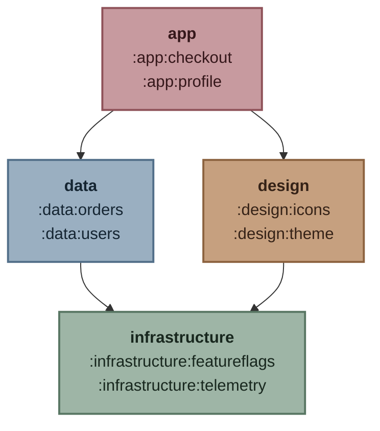

# Strata

Strata is a Gradle plugin that enforces an explicit dependency graph between project-backed architectural layers.
Each layer is one existing top-level Gradle project. That project and all its descendants belong to the layer automatically.

For example, a build with layers **app**, **data**, **design**, & **infrastructure** can use this plugin to
allow `:app` to depend on the sibling `:data` and `:design` layers, which may both depend on `:infrastructure`.

```text
Root project 'example'
+--- Project ':app'
|    +--- Project ':app:checkout'
|    \--- Project ':app:profile'
+--- Project ':data'
|    +--- Project ':data:orders'
|    \--- Project ':data:users'
+--- Project ':design'
|    +--- Project ':design:icons'
|    \--- Project ':design:theme'
\--- Project ':infrastructure'
     +--- Project ':infrastructure:featureflags'
     \--- Project ':infrastructure:telemetry'
```



## Configuration

Apply the collector plugin in `settings.gradle.kts`. It is used to analyze project dependencies in a project-isolated way.

```kotlin
plugins {
    id("com.jzbrooks.strata.collector") version "0.0.1"
}
```

Then apply and configure Strata in the root build:

```kotlin
plugins {
    id("com.jzbrooks.strata") version "0.0.1"
}

strata {
    layer(":app") {
        dependsOn(":data", ":design")
    }
    layer(":data") {
        dependsOn(":infrastructure")
    }
    layer(":design") {
        dependsOn(":infrastructure")
    }
    layer(":infrastructure") {}

    ignoreProject(":benchmark")
    ignoreConfiguration("specialMigrationConfiguration")

    allow(
        from = ":infrastructure:legacy",
        to = ":data:legacy-model",
        because = "Temporary exception tracked by ARCH-123",
    )

    unclassifiedProjects.set(UnclassifiedProjectPolicy.FAIL)
}
```

For example, this dependency points against the configured layer direction:

```kotlin
// infrastructure/telemetry/build.gradle.kts
dependencies {
    implementation(project(":app:profile"))
}
```

Running `./gradlew checkArchitecturalLayers` fails with an actionable error:

```text
Forbidden architectural dependency: :infrastructure -> :app

Source project:          :infrastructure:telemetry
Source layer project:    :infrastructure
Configuration:           implementation

Target project:          :app:profile
Target layer project:    :app

Declared from:
  infrastructure/telemetry/build.gradle.kts

Likely declaration:
  implementation(project(":app:profile"))

Suggested fixes:
- If architecturally sound, add dependsOn(":app") to layer(":infrastructure").
- Reverse or invert the dependency so ':app' does not own a dependency required by ':infrastructure'.
- Add a narrow, documented exception only when the violation is intentional and temporary.
```

Configure Strata once in the root project. Layer identities and `dependsOn` values must be absolute paths to
top-level projects, including the leading colon.
* Each layer may depend on its own project subtree and on layers reachable through its explicit `dependsOn` declarations.
* Dependencies are transitive, forward references are supported, and declaration order affects only report display.
* Cycles and unknown layer paths are configuration errors.
* Direct project dependencies declared in all declarable configurations are checked without resolving configurations.

Run `./gradlew checkArchitecturalLayers` to validate the build or `./gradlew architecturalLayersReport` to inspect the classification. `checkArchitecturalLayers` is also attached to the root `check` lifecycle task.

Ignored project paths cover the named project and its descendants.
Allowances match only the exact directed source and target paths and require a non-blank justification.

## License

Strata is available under the [MIT License](LICENSE).
