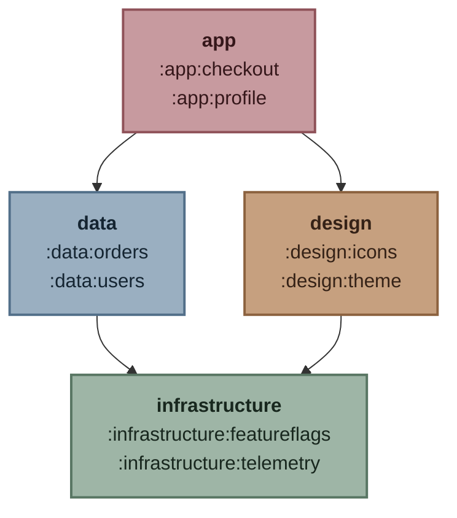

# Strata

[](https://github.com/jzbrooks/strata/actions/workflows/build.yml)
[](https://ossindex.sonatype.org/component/pkg:maven/com.jzbrooks/strata)

Strata is a Gradle plugin that enforces an explicit dependency graph between architectural layers in a multi-project build.
Each layer is represented by an existing top-level project. That project and all of its child projects belong to the layer automatically.

## Defining Layers
For example, a build with **app**, **data**, **design**, and **infrastructure** layers can allow the `:app` layer to depend on the `:data` and `:design` layers, both of which may depend on `:infrastructure`.

```text
Root project 'example'
+--- Project ':app'
+--- Project ':data'
+--- Project ':design'
\--- Project ':infrastructure'
```

Layers are defined via the `strata` extension.

```kotlin
strata {
    layer(":app") {
        dependsOn(":data", ":design")
    }
    layer(":data") {
        dependsOn(":infrastructure")
    }
    layer(":design") {
        dependsOn(":infrastructure")
    }
    layer(":infrastructure") {}
}
```

### Example Failure

With this graph, dependencies may point toward `:infrastructure`, but not back toward `:app`, `:data`, or `:design`. For example, a project dependency from `:infrastructure` to `:design` makes the `:checkArchitecturalLayers` task fail.

```text
1. infrastructure/build.gradle.kts:
   implementation(project(":design"))

Found 1 forbidden architectural dependency. See report: /path/to/project/build/reports/strata/architectural-layers.txt
```

Layer permissions are transitive: because `:app` may depend on `:data`, and `:data` may depend on `:infrastructure`, `:app` may also depend on `:infrastructure` without listing it directly.

## Child Projects
In larger builds, each top-level layer project can group any number of child projects. Classification follows the Gradle project path hierarchy, so, for example, `:app:checkout` belongs to the `:app` layer.

```text
Root project 'example'
+--- Project ':app'
|    +--- Project ':app:checkout'
|    \--- Project ':app:profile'
+--- Project ':data'
|    +--- Project ':data:orders'
|    \--- Project ':data:users'
+--- Project ':design'
|    +--- Project ':design:icons'
|    \--- Project ':design:theme'
\--- Project ':infrastructure'
     +--- Project ':infrastructure:featureflags'
     \--- Project ':infrastructure:telemetry'
```



### Example Failure

If a dependency points against the configured layer direction:

```kotlin
// infrastructure/telemetry/build.gradle.kts
dependencies {
    implementation(project(":app:profile"))
}
```

Running `./gradlew :checkArchitecturalLayers` fails with a concise error pointing to the complete report:

```text
1. infrastructure/telemetry/build.gradle.kts:
   implementation(project(":app:profile"))

Found 1 forbidden architectural dependency. See report: /path/to/project/build/reports/strata/architectural-layers.txt
```


## Configuration

Apply the collector settings plugin in `settings.gradle.kts`. It registers dependency collection for each project in a way that is compatible with Gradle's Isolated Projects feature. Use the same Strata version for both plugins.

```kotlin
plugins {
    id("com.jzbrooks.strata.collector") version "0.0.1"
}
```

Then apply and configure Strata in the root project's `build.gradle.kts`:

```kotlin
plugins {
    id("com.jzbrooks.strata") version "0.0.1"
}

strata {
    layer(":app") {
        dependsOn(":data", ":design")
    }
    layer(":data") {
        dependsOn(":infrastructure")
    }
    layer(":design") {
        dependsOn(":infrastructure")
    }
    layer(":infrastructure") {}

    ignoreProject(":benchmark")
    ignoreConfiguration("specialMigrationConfiguration")

    allow(
        from = ":infrastructure:legacy",
        to = ":data:legacy-model",
        because = "Temporary exception tracked by ARCH-123",
    )
}
```

Configure Strata once on the root project. The paths passed to `layer` and `dependsOn` must be absolute paths of top-level projects, including the leading colon.

* A project may depend on projects in its own layer and in every layer reachable through the configured `dependsOn` graph.
* Forward references are supported. Declaration order does not affect validation; the report lists layers in declaration order.
* Cycles, duplicate layers, unknown layers, and malformed or nonexistent project paths are configuration errors.
* Strata checks direct `ProjectDependency` declarations in every declarable configuration without resolving the configurations or inspecting external module dependencies.
* Projects are unclassified unless their top-level project is declared as a layer. The default `FAIL` policy rejects unclassified projects; `unclassifiedProjects.set(com.jzbrooks.strata.UnclassifiedProjectPolicy.IGNORE)` excludes them from validation.

Run `./gradlew :checkArchitecturalLayers` to validate the build, or `./gradlew :architecturalLayersReport` to generate
the report without failing on violations. Strata also makes the root `:check` lifecycle task depend on
`:checkArchitecturalLayers`. Each invocation generates the root project's `build/reports/strata/architectural-layers.txt`,
even when no violations are found. The report task is never considered up-to-date, so changes to project dependency
declarations cannot leave a stale report.

An ignored project path covers that exact project and all of its child projects, whether they are the source or
target of a dependency. An ignored configuration name applies build-wide. Allowances match only an exact, directed pair
of source and target project paths and require a non-blank justification.

The check prints the first five forbidden declarations before directing you to the report for the complete result.

## Reports
The text report provides additional information for diagnosing violations:

* The overall status and violation count
* Every forbidden project dependency, including its configuration and declaring build script
* A tree of forbidden project dependencies for each offending source project
* Projects classified by layer, together with each layer's direct and effective permissions

## Build

This project uses Gradle. Use the included Gradle Wrapper:

* Assemble the plugin artifacts: `./gradlew assemble`
* Run verification, including tests: `./gradlew check`
* List available tasks: `./gradlew tasks`

## License

Strata is available under the [MIT License](LICENSE).
